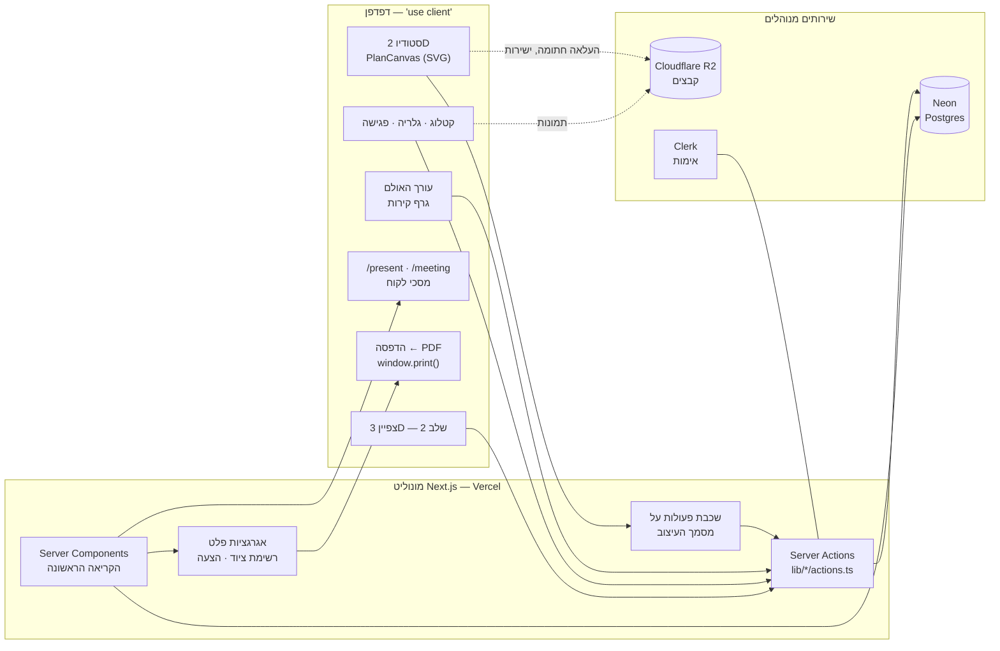

# מסמך ארכיטקטורה וטכנולוגיות — פלטפורמת עיצוב אירועים

גרסה 0.4 | אוגוסט 2026 | מעדכן את 0.3 (יולי 2026)

**מה עושה הגרסה הזאת.** 0.3 תיארה ארכיטקטורה מתוכננת. מאז נבנתה המערכת, ושלוש מההמלצות שלה לא שרדו את המפגש עם הקוד: ספריית הקנבס, מחולל ה-PDF בשרת, וכל צנרת ייבוא ה-PDF. במקביל נסגרו שלושת השירותים המנוהלים בשמותיהם — **Neon** (Postgres), **Cloudflare R2** (קבצים) ו-**Clerk** (אימות) — מעל **Vercel**. זהו מצב הארכיטקטורה המוסכם, ולא תוכנית.

שני פרקים כאן לא היו ב-0.3: §8, החלטות שהתהפכו (כדי שלא ייבנו שוב מתוך שכחה), ו-§9, עלות התפעול החודשית בפועל.

תמונת הריצה — מה רץ בדפדפן, מה בשרת, ומה שכור — היא [architecture.html](architecture.html). המסמך הזה הוא ההחלטות שמאחוריה.

---

## 1. עקרונות מנחים

הארכיטקטורה מותאמת למבנה הצוות: מפתח יחיד. מכאן נגזרים ארבעה עקרונות שגוברים על כל שיקול אחר:

1. **מונוליט, לא מיקרו־שירותים.** בסיס קוד אחד, פריסה אחת, לוג אחד. פיצול לשירותים הוא פתרון לבעיית תיאום בין צוותים — בעיה שאין לך.
2. **שפה אחת לכל המחסנית.** TypeScript בצד לקוח ובצד שרת. החלפת הקשר בין שפות היא מס קבוע על מפתח יחיד, וטיפוסים משותפים בין הקנבס לשרת חוסכים באגים אמיתיים.
3. **שירותים מנוהלים בכל מקום שאפשר.** מסד נתונים, אחסון קבצים, אימות, פריסה — הכול כשירות. שעת תחזוקת שרתים היא שעה שלא נבנה בה מוצר.
4. **טכנולוגיה משעממת.** כל רכיב שהוא לא בידול מוצרי (הזיהוי, הסטודיו) נבחר לפי בגרות ותיעוד, לא לפי עניין.

ארבעתם עמדו במבחן. שלוש ההחלטות שהתהפכו (§8) התהפכו **בגללם** ולא נגדם: כל אחת מהן הסירה תלות, שירות או חשבון חודשי.

## 2. החלטות ארכיטקטוניות (ADRs)

### ADR-1: אפליקציית ווב — בתוקף

**החלטה:** SPA בדפדפן, ללא דסקטופ נייטיב. **נימוק:** היעד הסופי SaaS; לינק ההדמיה ללקוח מחייב ווב ממילא; פריסה ועדכון פשוטים פי כמה. **מחיר:** ביצועי קנבס בדפדפן דורשים משמעת, ואין offline בשלב 1.

### ADR-2: רב־דייריות במודל הנתונים מיום ראשון — בתוקף, מומש

**החלטה:** כל ישות ששייכת לסטודיו נושאת `organization_id`, וכל שאילתה מסוננת לפיו — גם כשקיים ארגון אחד. **מצב:** מומש. טבלאות ה-join יורשות את הדייר דרך ההורים שלהן, ושני חריגים מכוונים מתועדים בסכימה: `venue_grants`, שכל תפקידו לחצות את הגבול הזה (שני סטודיו יכולים לעבוד באותו אולם פיזי), ו-`users.organization_id` שהוא nullable — כי חשבון לקוח אינו שייך לשום סטודיו. **גבול ההחלטה נשמר:** אין חיוב ואין בידוד ברמת תשתית. RLS ייכתב כשיהיה דייר שני אמיתי.

### ADR-3: ייבוא PDF חצי־אוטומטי — **בוטלה**

**מה 0.3 החליטה:** מסך הנחה ידנית על גבי PDF, ואחריו צנרת זיהוי (pdf.js לווקטורי, OpenCV ל-scan) שמזינה אותו בהצעות.

**מה הוחלט במקומה:** אין ייבוא PDF כלל. האולם נמדד פעם אחת ומצויר באפליקציה: גרף קירות יחיד לנכס, והאזורים הם **מזהים מעל אזורים בגרף** ולא פוליגונים משלהם. קיר שזז משנה את האזור, במקום להשאיר עותק מיושן.

**נימוק:** הסקיצה שמגיעה מאולם היא ממילא קובץ שצריך אימות ידני מלא; מה שנחסך היה הקלדה, ומה ששולם היה המרכיב היקר ביותר במערכת — עיבוד ברקע, ריצת Python, ותלות בשירות שני. ציור האולם קורה פעם אחת לנכס, לא פעם באירוע. **מה שנשאר מזה:** `PlanUnderlay` — תמונת רקע להתחקות ידנית — טיפוס שממתין ל-R2 (§7).

### ADR-4: הפרדת מסמך מרינדור — בתוקף, מומש

**החלטה:** "מסמך העיצוב" הוא מבנה נתונים טהור (JSON: שולחנות, שיבוצים, שכבות, כיול) שאינו יודע דבר על תצוגה. הקנבס הדו־ממדי, הפלט התפעולי, ההצעה וסצנת ה-3D הם רנדררים של אותו מסמך. **מצב:** שכבת הפעולות היא `lib/design-document/actions.ts`, ואף רנדרר אינו כותב למסמך ישירות. זו ההחלטה שהפכה את רשימת הציוד ואת הצעת המחיר לאגרגציות זולות, ואת ה-undo/redo לכמעט־חינם.

### ADR-5: 3D בקירוב, לא במידול (שלב 2) — בתוקף

**החלטה:** כל פריט מיוצג בפרימיטיב ממדי (גליל/תיבה במידות האמת) עם תמונת המוצר כטקסטורה. **נימוק:** האפקט המכירתי מגיע מהפרופורציות ומהפריסה בחלל, לא מפוטוריאליזם של פמוט בודד. **דלת יציאה:** אפשר להעלות פריטים נבחרים למודלים אמיתיים בלי לשנות ארכיטקטורה. גובה כל מוצר כבר עמודה NOT NULL בקטלוג בדיוק בשביל זה.

### ADR-6: מונוליט TypeScript על תשתית מנוהלת — בתוקף, בלי החריג

**החלטה:** אפליקציית Next.js אחת (ממשק + שרת), Postgres מנוהל, אחסון אובייקטים, אימות מנוהל. **מה השתנה:** החריג היחיד ש-0.3 חרתה — job רקע לעיבוד PDF כבד — בוטל יחד עם ADR-3. אין worker, אין תור, ואין פריסה שנייה מכל סוג. אין גם API routes: "השרת" הוא הקבצים שלא כתוב בהם `"use client"`.

### ADR-7 (חדש): שלושה שירותים שכורים, בשמותיהם — Neon, R2, Clerk

**החלטה:** Postgres ב-**Neon**, קבצים ב-**Cloudflare R2**, אימות ב-**Clerk**, והכול על **Vercel**. **נימוק:** שלושתם צריכים להחזיק דיסק או סוד, ופלטפורמת פריסה לא נותנת לקוד שלך אף אחד מהשניים.

**למה לא חבילת Supabase אחת** (שהייתה חלופה שקולה ב-0.3, וש-`.env.example` היה כתוב לפיה): החשבון של המוצר הזה נשלט על ידי **תמונות**. ב-R2 ה-egress חינם; ב-Supabase Storage הוא 250GB כלולים ואחריהם $0.09 לג׳יגה — כלומר לקוח שמדפדף בגלריה מייצר שורה בחשבון. עלות אחסון התמונות עצמה זניחה בשני המקרים; מה שנחסך הוא הצמיחה. המחיר של ההחלטה: שלושה לוחות בקרה במקום אחד.

### ADR-8 (חדש): הקנבס נכתב ידנית ב-SVG, לא Konva

**החלטה:** `components/plan-canvas.tsx` — SVG כתוב יד — הוא משטח התוכנית היחיד בכל האפליקציה. **נימוק:** נבנה בלי Konva, ואחרי שלושה משטחים (סטודיו, עורך אולם, מפות פלט) שום דבר שהספרייה מציעה לא היה חסר. גרירה, זום, הצמדה ובחירה הם ממילא קוד שלנו, כי כולם מדברים במילימטרים ובחוקי ההצמדה של המוצר. **כלל:** כל משטח תוכנית חדש מרחיב את הרכיב הזה. אין SVG כתוב יד שני.

### ADR-9 (חדש): ייצוא PDF דרך הדפסת הדפדפן, לא רינדור בשרת

**החלטה:** מפת ההצבה, רשימת הציוד וההצעה נוצרות ב-`window.print()` מתוך אותם מסכים שמציגים אותן. **נימוק:** 0.3 המליצה על HTML→PDF עם Playwright בשרת, בעיקר בשביל RTL ועברית. הדפדפן נותן את אותו RTL בדיוק — ובלי Chromium ברקע, שהוא הפריט היקר ביותר בחשבון החודשי והסיבה היחידה שהייתה נשארת להריץ קונטיינר. **מחיר:** שליטה בפגינציה נעצרת בגבולות `@media print`. אם יום אחד תידרש חוברת רב־עמודית ממוספרת, זו נקודת ההחלטה לשוב ולשקול — לא לפני.

### ADR-10 (חדש): Clerk עונה על "מי", וזה הכול

**החלטה:** האימות עובר ל-Clerk. **ההרשאות והדיירות נשארות בטבלאות שלנו** — `organizations`, `users`, `venue_grants`, `event_clients`. **נימוק:** שני סולמות ההרשאה של המוצר (חבר סטודיו מול אורח נכס) הם לוגיקה מוצרית, לא זהות. העברתם ל-Clerk Organizations לא קונה דבר ומכניסה תוסף B2B של $100 לחודש בין הסטודיו לתפקידים של עצמו.

**מה נמחק כשזה נוחת:** גיבוב הסיסמאות (`lib/auth/password.ts`), טבלת `sessions`, `users.password_hash` ושומר ה-cookie — כ-570 שורות שאין סיבה להיות הבעלים שלהן. **מה נשאר:** שורת ה-`users`, ממופתחת מחדש למזהה של Clerk, כולל `kind` (studio/client) ו-`role`. **מתי:** לפני שנרשם הסטודיו החיצוני הראשון. הגירה של סיסמאות אמיתיות גרועה מהגירה של אפס סיסמאות.

## 3. תרשים רכיבים

שלוש נקודות שהתרשים אמור להעביר: הגרירה בקנבס לא נוגעת ברשת (רק המסמך כמכלול נשלח, ב-debounce של 500ms); בתים של תמונות לא עוברים דרך תהליך ה-Node — הדפדפן מעלה ל-R2 ישירות עם URL חתום; ואין תיבה רביעית. כל מה שאינו מסד, קבצים או אימות — נשאר בפנים.

## 4. מודל נתונים — 21 טבלאות

כל ישות ששייכת לסטודיו נושאת `organization_id` (ADR-2); טבלאות ה-join יורשות את הדייר דרך ההורים שלהן. הסמכות היא [lib/db/schema.ts](../lib/db/schema.ts); זה המפתח אליה.

**הדייר והאנשים**
- `organizations` — הדייר. שלב 1: רשומה אחת.
- `users` — **כל** בעלי החשבון בטבלה אחת, כי לאדם יש סט הזדהות אחד. `kind` מפריד סטודיו מלקוח; `organization_id` הוא NULL ללקוח; `password_hash` הוא NULL למי שהוזמן ועוד לא הצטרף (ויימחק כליל עם ADR-10).
- `sessions` — דפדפן מחובר. שומרת **hash** של הטוקן, כדי שדליפת מסד לא תהיה התחברות. קיימת כדי שאפשר יהיה **לשלול** גישה; נעלמת עם Clerk.
- `studio_settings` — שורה אחת לארגון: נייר המכתבים, מע"מ, מטבע, ו-`meeting_flow` — **שלבי הפגישה כמערך מסודר**. זרימת הפגישה היא הגדרה של הסטודיו, לא מערך קבוע בקוד.
- `venue_grants` — אורחי נכס: הסולם השני, הנפרד. `kind` קובע מה ההרשאה מקנה; אורח מקבל תוכנית וזמינות אנונימית — לעולם לא אירועים, לקוחות או מחירים.

**קטלוג**
- `products` — מידות בעמודות שטוחות (גובה NOT NULL, לטובת שלב 2), `category_fields` כ-JSONB לשדות מכפילי־כמות בלבד, `appearance` למראה על המפה.
- `product_variants` — גוון/גרסה, תמונה, מחיר שיורש מהמוצר אם ריק. כל שיבוץ מפנה לווריאנט, כדי שרשימת הציוד תפריד גוונים.

**הנכס** — זו החלפה מלאה של `HallTemplate` ו-`FloorPlan` מ-0.3
- `venues` — מישור מילימטרי אחד לנכס: `mmPerUnit`, קו המגרש, ותמונת הרקע להתחקות.
- `venue_structures` — **גרף הקירות היחיד** של הנכס (צמתים, קירות, פתחים, אלמנטים קבועים), שורה אחת, נקראת ונכתבת כמקשה. כל ערכו בכך שקיר משותף לשני חללים קיים בו בדיוק פעם אחת.
- `zones` — אזור: שם, סוג, גובה תקרה (0 = פתוח לשמיים), ותפוסה. **בלי גיאומטריה משלו** — `source` מצביע על אזור בגרף, והצורה נגזרת מהקירות בכל קריאה.

**אירועים**
- `events` — לקוח, אנשי קשר, תאריך (`date`, לא `timestamptz` — חתונה היא יום בלוח השנה, ואזור זמן לא אמור להזיז אותה), אולם, אומדן אורחים. **אין עמודת סטטוס:** המצב נגזר מ-`step`, השלב הרחוק ביותר שהפגישה הגיעה אליו בזרימה **המוגדרת** של הסטודיו.
- `event_zones` — אילו אזורים האירוע תופס, בסדר של המעצב. טבלת join ולא מערך מזהים, בשביל מפתח זר והשאלה ההפוכה: "אילו אירועים עומדים על האזור הזה?", שעורך האולם חייב לשאול לפני מחיקה.
- `event_clients` — אילו חשבונות לקוח רואים אילו אירועים. השורה **היא** מעשה השיתוף; מחיקתה היא ביטולו. אינה הופכת לקוח לחבר סטודיו.

**מסמך העיצוב** (ADR-4)
- `design_documents` — `content` כ-JSONB, ו-`version` שהיא היסטוריה אמיתית: כל שמירה היא שורה חדשה, ולכן הצעת מחיר יכולה להינעל לגרסת הציור שממנה הופקה (F-6.4, F-7.4). השיבוצים נשארים JSONB ולא שורות — הקנבס קורא וכותב אותם כערך אחד.

**גלריה** — `gallery_images` (כל תמונה מקושרת למוצר קטלוג אחד; `image_url` יהיה NULL עד ש-R2 יעלה), `presentations`, `presentation_images` (join עם סדר ידני), `event_liked_images` ("תיק האירוע" — מה שהלקוח אהב בפגישה).

**פלטים** — `packing_spares` (עודפים ידניים מעל מה שהמסמך סופר), `exports` (מה הופק ומאיזו גרסה), `issued_quotes` (הצעה נעולה לגרסת מסמך).

## 5. טכנולוגיות — מה רץ בפועל

| רכיב | מה נבחר בפועל | מה 0.3 המליצה | הערה |
|---|---|---|---|
| מסגרת | Next.js 16.2 (App Router) · React 19 · TypeScript 5 | Next.js | כמתוכנן |
| קנבס 2D | `components/plan-canvas.tsx` — SVG כתוב יד | Konva.js | **שונה** — ADR-8 |
| עיצוב | Tailwind v4, טוקנים ב-`app/globals.css` | — | בלי ספריית רכיבים; אייקונים lucide-react |
| גישה לנתונים | Drizzle ORM מעל postgres.js, pool עצל יחיד | — | `lib/db/index.ts` |
| מסד נתונים | **Neon** — חיבור pooled לאפליקציה, ישיר למיגרציות | Neon/Supabase | ADR-7 |
| מיגרציות | drizzle-kit | — | `db:push` בפיתוח; `generate`+`migrate` כשיש נתונים |
| אחסון קבצים | **Cloudflare R2**, העלאה חתומה מהדפדפן | R2/Supabase | egress חינם — ADR-7 |
| אימות | **Clerk** (מחליף את `lib/auth/` הידני) | Supabase Auth / Clerk | ADR-10 |
| ייצוא PDF | הדפסת דפדפן | Playwright בשרת | **שונה** — ADR-9 |
| ייבוא PDF וזיהוי | — | pdf.js + OpenCV job | **בוטל** — ADR-3 |
| 3D (שלב 2) | Three.js (react-three-fiber) | אותו דבר | להחליט בתחילת שלב 2 |
| בדיקות | 17 סקריפטי self-check ב-tsx + `tsc --noEmit` | — | על הלוגיקה הטהורה; אין מסגרת בדיקות |
| פריסה | Vercel | Vercel/Railway + worker | בלי worker |

תלות אחת נשארה יתומה: `pdfjs-dist` יושבת ב-`package.json` ואף קובץ לא מייבא אותה. שריד של ADR-3.

## 6. מה במפורש לא בונים

מיקרו־שירותים ותורים מבוזרים; API routes (שכבת ה-server actions היא הממשק); worker או קונטיינר כלשהו; חיפוש ייעודי (Postgres מספיק); קאש (Redis) לפני שיש בעיית ביצועים מדודה; **ספק דיוור** — הזמנת חבר צוות מייצרת **קישור הצטרפות** (`/join/<token>`) שהמעצב מעתיק ושולח בוואטסאפ, ולא מייל. זו לא פשרה זמנית אלא התאמה לשוק: כך ממילא מדברים כאן, וזה עובד מהטלפון באמצע פגישה. Clerk יביא איתו דואר אימות ואיפוס כשינחת (ADR-10), ודואר מוצרי ייפתח רק כשתישלח הצעת מחיר מתוך המערכת; עריכה שיתופית בזמן אמת; מערכת הרשאות גרנולרית מעבר לשני הסולמות הקיימים; אפליקציה נייטיבית.

## 7. מצב המימוש — אוגוסט 2026

| תחום | היכן הנתונים | הערה |
|---|---|---|
| חשבונות והתחברות | Postgres | ידני היום, Clerk בהמשך (ADR-10) |
| אירועים וזרימת הפגישה | Postgres | |
| קטלוג ווריאנטים | Postgres | |
| אולמות, מבנה ואזורים | Postgres | |
| הגדרות הסטודיו | Postgres | |
| פורטל הלקוח | Postgres | |
| **מסמכי העיצוב** | localStorage | הנכס היחיד בעל ערך שעדיין חי בפרופיל דפדפן |
| גלריה ותצוגות | localStorage | ריקה עד R2 |
| הצעות מחיר, עודפי אריזה, גרסאות ייצוא | localStorage | |
| אנשי הסטודיו | localStorage | הטבלה כבר קיימת |
| איזה אירוע/אולם פתוח במכשיר | localStorage — **במכוון** | מיקום UI פר־מכשיר, לא נתוני סטודיו |

**סדר העבודה שנותר:**

1. **מסמכי העיצוב ל-Postgres.** התפר כבר חתוך — `lib/studio/storage.ts` מתחלף, ואף מסך מעליו לא משתנה. חמישה תחומים כבר עברו כך בלי לשכתב מסך אחד.
2. **R2.** אותה יכולת חסרה אחת פותחת שלושה דברים: צילומי גלריה, תמונות מוצר, והתחקות על תוכנית אמיתית של אולם (`PlanUnderlay`).
3. שאר הפלטים (הצעות, עודפים, גרסאות) — אותה תבנית.
4. **Clerk.** חוסם כלום, ולכן אחרון — אבל לפני הסטודיו החיצוני הראשון.

## 8. החלטות שהתהפכו מ-0.3

מתועדות כדי שלא ייבנו שוב מתוך שכחה, ולא כדי להתנצל עליהן. שלושתן צמצמו את המערכת.

| מה 0.3 אמרה | מה קרה | מה זה חסך |
|---|---|---|
| Konva.js לקנבס | SVG כתוב יד (ADR-8) | תלות, ושכבת תרגום בין המודל המילימטרי שלנו לזה של הספרייה |
| Playwright בשרת ל-PDF | `window.print()` (ADR-9) | ריצת Chromium — הפריט היקר בחשבון, והסיבה היחידה להריץ קונטיינר |
| pdf.js + OpenCV job לייבוא | ציור האולם באפליקציה (ADR-3) | תהליך רקע, ריצת Python, וחריגה משפה אחת (עקרון 2) |

## 9. עלות תפעול

סטודיו אחד, נתוני לקוחות אמיתיים, גיבויים שקיימים. מחירי ספקים נבדקו באוגוסט 2026 ומשתנים — הסדר גודל הוא מה שיציב כאן, לא הספרה.

| שירות | תוכנית | לחודש | מה קובע את המספר |
|---|---|---|---|
| Vercel | Pro | $20 | לפי מושב. Hobby אסור לשימוש מסחרי |
| Neon | Launch (לפי צריכה) | $5–19 | שעות מחשוב, לא שורות. הנתונים עצמם זניחים בג׳יגות |
| Cloudflare R2 | לפי צריכה | $0–2 | 10GB חינם, אחריהם $0.015 לג׳יגה. **egress חינם** |
| Clerk | חינם | $0 | חינם עד 50,000 משתמשים חודשיים |
| דומיין | — | $1–3 | |
| | | **$26–44** | ≈ 95–160 ₪ |

**מה לא בחשבון, וזה מלמד כמו מה שכן:** אין שירות רינדור PDF (ADR-9), אין worker ואין תור (ADR-3, ADR-6), אין Redis, אין שירות חיפוש, אין ספק דיוור (Clerk שולח את דואר ההתחברות), ואין פריסה שנייה. כל אחד מהם הוא חשבון חודשי שנחסך בכך שלא נדרש.

**מה שגדל עם הצלחה:** תמונות, ולאט. פי עשרה גלריה עדיין מתחת ל-$2 אחסון, כי הבתים שיוצאים ללקוחות — החלק שהיה שולט בחשבון ב-S3 — חינם ב-R2. אם זה יהפוך למוצר לעשרים סטודיו, המספר הריאלי הוא $100–150 לחודש, וצורת החשבון לא משתנה.

**המלכודת היחידה ששווה לזכור:** תוסף ה-B2B של Clerk, $100 לחודש. נמנעים ממנו על ידי כך שהתפקידים נשארים בטבלאות שלנו (ADR-10).
