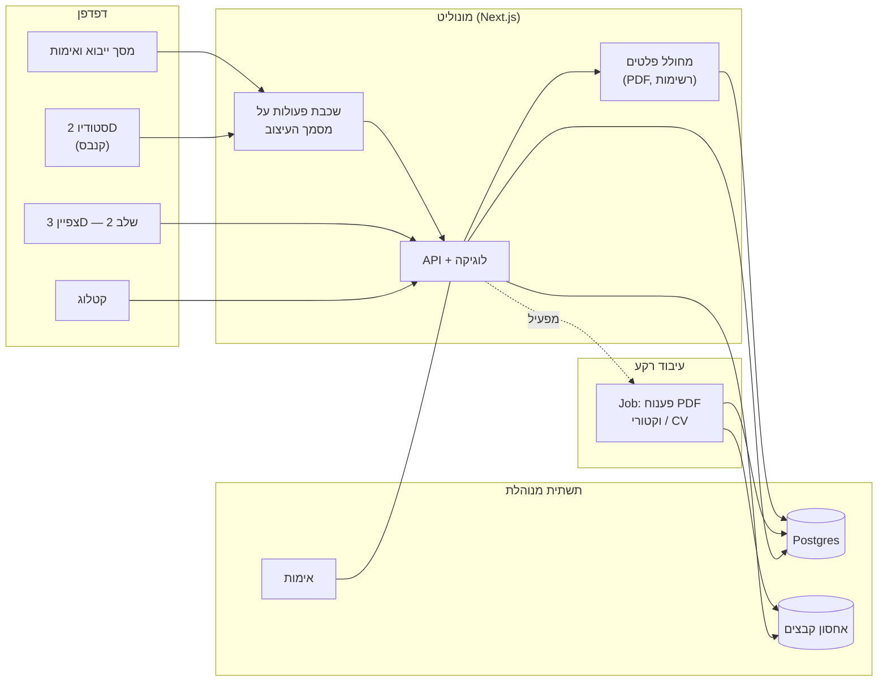

# מסמך ארכיטקטורה וטכנולוגיות — פלטפורמת עיצוב אירועים

גרסה 0.3 | יולי 2026 | נגזר ממסמך הדרישות 0.3 (שני מצבי עבודה, תצוגות גלריה, תבנית אולם כשלד)

---

## 1. עקרונות מנחים

הארכיטקטורה מותאמת למבנה הצוות: מפתח יחיד. מכאן נגזרים ארבעה עקרונות שגוברים על כל שיקול אחר:

1. **מונוליט, לא מיקרו־שירותים.** בסיס קוד אחד, פריסה אחת, לוג אחד. פיצול לשירותים הוא פתרון לבעיית תיאום בין צוותים — בעיה שאין לך.
2. **שפה אחת לכל המחסנית.** TypeScript בצד לקוח ובצד שרת. החלפת הקשר בין שפות היא מס קבוע על מפתח יחיד, וטיפוסים משותפים בין הקנבס לשרת חוסכים באגים אמיתיים.
3. **שירותים מנוהלים בכל מקום שאפשר.** מסד נתונים, אחסון קבצים, אימות, פריסה — הכול כשירות. שעת תחזוקת שרתים היא שעה שלא נבנה בה מוצר.
4. **טכנולוגיה משעממת.** כל רכיב שהוא לא בידול מוצרי (הזיהוי, הסטודיו) נבחר לפי בגרות ותיעוד, לא לפי עניין.

## 2. החלטות ארכיטקטוניות (ADRs)

### ADR-1: אפליקציית ווב

**החלטה:** SPA בדפדפן, ללא דסקטופ נייטיב. **נימוק:** היעד הסופי SaaS; לינק ההדמיה ללקוח מחייב ווב ממילא; פריסה ועדכון פשוטים פי כמה. **מחיר:** ביצועי קנבס בדפדפן דורשים משמעת (ראה ADR-4), ואין offline בשלב 1.

### ADR-2: רב־דייריות במודל הנתונים מיום ראשון

**החלטה:** כל טבלה נושאת `organization_id`, וכל שאילתה מסוננת לפיו — גם כשקיים ארגון אחד. **נימוק:** התוספת עכשיו עולה שעות; הוספה בדיעבד למסד חי היא פרויקט הסבה מסוכן. **גבול ההחלטה:** מודל הנתונים בלבד. אין בונים עכשיו הרשמה, חיוב, ניהול משתמשים או בידוד ברמת תשתית — זה שלב 3.

### ADR-3: הייבוא החצי־אוטומטי הוא מוצר, והמסלול הידני קודם לו

**החלטה:** בונים קודם את מסך ההנחה־ידנית־על-PDF (F-3.3), ורק אחר כך את צנרת הזיהוי שמזינה אותו בהצעות (F-9.4, שלב 2/3). **נימוק:** מסך האימות זהה בשני המקרים; כך המערכת שמישה מוקדם, וצנרת הזיהוי הופכת משאלת "יש/אין מוצר" לשאלת "כמה זמן נחסך". **צנרת הזיהוי (כשנגיע):** שני מסלולים — וקטורי: חילוץ ישויות גיאומטריות מה-PDF וסיווג צורות לפי היוריסטיקות (עיגולים בקוטר שולחן, מלבנים ביחסי גודל מוכרים); סרוק: רסטריזציה + ראייה ממוחשבת (זיהוי עיגולים/מלבנים ב-OpenCV), בביטחון נמוך יותר. תוצאת בדיקת R-1 (עשרת הקבצים) קובעת כמה להשקיע בכל מסלול.

### ADR-4: הפרדת מסמך מרינדור

**החלטה:** "מסמך העיצוב" הוא מבנה נתונים טהור (JSON: שולחנות, שיבוצים, שכבות, כיול) שאינו יודע דבר על תצוגה. הקנבס הדו־ממדי, מחולל ה-PDF התפעולי וסצנת ה-3D הם שלושה רנדררים של אותו מסמך. **נימוק:** זו ההחלטה שהופכת את שלב 2 (3D) ואת רשימת הציוד לזולים — רשימת הציוד היא בסך הכול agregation על המסמך. **השלכה:** אסור לרנדרר לכתוב למסמך ישירות; כל שינוי עובר דרך שכבת פעולות (actions) אחת, שגם נותנת undo/redo כמעט בחינם.

### ADR-5: 3D בקירוב, לא במידול (שלב 2)

**החלטה:** כל פריט מיוצג בפרימיטיב ממדי (גליל/תיבה במידות האמת) עם תמונת המוצר כטקסטורה או כ-billboard. **נימוק:** האפקט המכירתי מגיע מהפרופורציות והפריסה בחלל, לא מפוטוריאליזם של פמוט בודד; מידול קטלוג שלם הוא עלות תוכן מתמשכת שאין לה הצדקה. **דלת יציאה:** אם לקוחות ידרשו יותר, אפשר להעלות פריטים נבחרים למודלים אמיתיים בלי לשנות ארכיטקטורה.

### ADR-6: מונוליט TypeScript על תשתית מנוהלת

**החלטה:** אפליקציית Next.js אחת (ממשק + API), Postgres מנוהל, אחסון אובייקטים ל-PDF ולתמונות, אימות מנוהל. חריג אחד: עיבוד PDF כבד (רסטריזציה, ראייה ממוחשבת) ירוץ כ-job רקע נפרד, כי הוא ארוך מדי לבקשת HTTP — אבל באותו בסיס קוד.

## 3. תרשים רכיבים

## 4. מודל נתונים — ישויות ליבה

כל הישויות נושאות `organization_id` (ADR-2).

- **Organization** — הדייר. שלב 1: רשומה אחת.
- **User** — משתמש, שייך לארגון.
- **Product** — פריט קטלוג: שם, תמונה, מידות (כולל גובה — חובה, לטובת שלב 2), שכבה (שולחן/רצפה/תקרה), קטגוריה, שדות מכפילי־כמות בלבד פר קטגוריה (JSONB: קנים בשנדליר/פמוט, כמות כסאות תקנית לשולחן — F-4.3), שדה מפרט חופשי לכל השאר, מחיר ליחידה, תגיות סטייל.
- **ProductVariant** — וריאנט של מוצר: גוון/גרסה, תמונה, מחיר (יורש מהמוצר אם ריק). כל שיבוץ במסמך העיצוב מפנה לוריאנט, כדי שרשימת הציוד וההצעה יפרידו גוונים.
- **Presentation** — תצוגה אצורה (F-2.1): שם, קטגוריה עיצובית ("חופות", "שדרות חופה"), וסדרת תמונות גלריה שסדרן נקבע ידנית.
- **GalleryImage** — תמונת גלריה (F-2.2): קובץ, שם, תיאור, וקישור למוצר קטלוג **אחד**. למוצר יכולות להיות תמונות רבות, מאירועים שונים.
- **HallTemplate** — שלד אולם (F-3.1): מידות וצורת החלל, כניסות, מכשולים (עמודים), אלמנטים כמעט־קבועים לפי בחירה (במה, בר), וכיול (מ"מ/יחידה). **אינו** שומר פריסות שולחנות — אלה מגיעות פר אירוע מ-iPlan.
- **Event** — אירוע: לקוח (שם, טלפון), תאריך, אולם, אומדן אורחים. המצב (סטטוס) **נגזר** מהשלב שאליו הגיעה זרימת הפגישה (F-1.1) — אין מכונת סטטוסים נפרדת.
- **FloorPlan** — תוצר הייבוא פר אירוע: הפניה ל-PDF, יישור על שלד התבנית, כיול (מ"מ/יחידה), רשימת שולחנות (סוג, מיקום, מידות, מספר).
- **DesignDocument** — לב המערכת (ADR-4): JSON גרסתי של שיבוצים — אילו מוצרים על אילו שולחנות/נקודות, בכמויות, לפי שכבות. כל שמירה יוצרת גרסה (לטובת F-6.4, F-7.4 ושחזור).
- **Export** — פלט שהופק: סוג (מפה/רשימה), גרסת מסמך, תאריך, קובץ.

הערת עיצוב: את השיבוצים עצמם עדיף כ-JSONB בתוך DesignDocument ולא כטבלת שורות — הם נקראים ונכתבים תמיד כמקשה אחת על ידי הקנבס, וגרסאות שלמות זולות יותר כך. רשימת הציוד מחושבת מה-JSON בזמן ייצוא.

## 5. טכנולוגיות מומלצות (עם חלופות)

| רכיב | המלצה | חלופה | הערה |
|---|---|---|---|
| מסגרת | Next.js (React, TS) | Vue/Nuxt | הבחירה ההופכית זולה עכשיו ויקרה בעוד חצי שנה — להחליט ולסגור |
| קנבס 2D | Konva.js (react-konva) | Fabric.js, PixiJS | Konva: אינטראקציה ושכבות טובות; PixiJS רק אם NFR-2 יישבר |
| תצוגת PDF ורקע | pdf.js | — | דה־פקטו הסטנדרט בדפדפן |
| חילוץ וקטורי | pdf.js (operator list) בצד שרת | pdfium | להכריע אחרי בדיקת R-1 |
| CV לקבצים סרוקים | OpenCV (Python job) | — | המסלול היחיד שמצדיק חריגה מ-TS; לדחות עד שנתקלים בקבצים סרוקים בפועל |
| מסד נתונים | Postgres מנוהל (Neon/Supabase) | — | JSONB למסמך העיצוב |
| אחסון קבצים | S3-compatible (R2/Supabase) | — | PDF מקוריים, תמונות מוצר, ייצואים |
| אימות | Supabase Auth / Clerk | NextAuth | מנוהל; לא לבנות לבד |
| ייצוא PDF תפעולי | רינדור HTML→PDF (Playwright) בצד שרת | pdf-lib | HTML נותן RTL ועברית בחינם — יתרון מכריע כאן |
| 3D (שלב 2) | Three.js (react-three-fiber) | Babylon.js | להחליט רק בתחילת שלב 2 |
| פריסה | Vercel/Railway + worker ל-jobs | Fly.io | הקטנת ops למינימום |

## 6. מה במפורש לא בונים עכשיו

מיקרו־שירותים ותורים מבוזרים; חיפוש ייעודי (Postgres מספיק); קאש (Redis) לפני שיש בעיית ביצועים מדודה; עריכה שיתופית בזמן אמת (CRDT/WebSocket) — undo/redo מקומי מספיק למשתמש יחיד; מערכת הרשאות גרנולרית; אפליקציה נייטיבית.

## 7. סדר בנייה מוצע (שלב 1)

הסדר נגזר מ-ADR-3 — קודם ערך, אחר כך אוטומציה:

1. שלד: פרויקט, אימות, מודל נתונים, שלדי האולמות שאתה עובד בהם (הקמה חד־פעמית, F-3.1).
2. קטלוג מוצרים + וריאנטים + הזנת הקטלוג האמיתי שלך (עבודת תוכן, במקביל).
3. סטודיו 2D: ייבוא סקיצה פר אירוע, הנחת שולחנות ידנית (F-3.2–F-3.3) ושיבוץ מוצרים.
4. פלט תפעולי: מפת הצבה ורשימת ציוד. **← כאן המערכת כבר חוסכת כסף.**
5. הצעת מחיר (רנדרר נוסף על אותו מסמך — עלות שולית) + הגדרות עסק (F-8.1).
6. גלריה, תצוגות ומצב הצגה (F-2.1–F-2.4) + זרימת הפגישה המנחה (F-1.1–F-1.9).
7. אירוע אמיתי ראשון דרך המערכת (Definition of Done של הליבה).
8. שלב 2: 3D ולינק צפייה; צנרת הזיהוי האוטומטי מ-PDF (F-9.4) — רק כשמופיע צורך אמיתי באולמות מתחלפים או לקראת SaaS.
